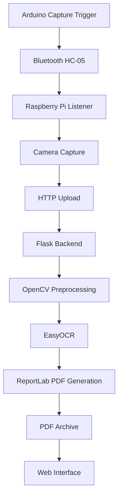

# Smart Archiving System

An end-to-end smart archiving system that captures classroom whiteboard content, processes the image with computer vision and OCR, and generates a searchable PDF archive.

The system combines an **Arduino-based capture trigger**, **Raspberry Pi camera**, **Bluetooth communication**, a **Flask backend**, **OpenCV image processing**, **EasyOCR**, and **ReportLab PDF generation**.

## Overview

The system is designed to simplify the process of archiving classroom whiteboard content.

A capture request starts on the Arduino and is transmitted through Bluetooth to a Raspberry Pi. The Raspberry Pi captures an image and sends it to the Flask application over the local network. The Flask application removes shadows from the image, extracts text using OCR, generates a PDF containing the processed image and extracted text, and makes the resulting documents available through a web interface.

```text
Arduino Capture Trigger
        ↓
Bluetooth HC-05
        ↓
Raspberry Pi
        ↓
Camera Capture
        ↓
HTTP Upload
        ↓
Flask Application
        ↓
OpenCV Image Processing
        ↓
EasyOCR Text Extraction
        ↓
ReportLab PDF Generation
        ↓
Web Archive
```

The main processing logic is implemented in Python rather than relying on an external document-archiving framework.

## Architecture



The system separates the capture hardware from the document-processing backend.

The Arduino and Raspberry Pi handle the physical capture workflow, while the Flask application performs image processing, OCR, PDF generation, and archive management.

## System Components

### Arduino

The Arduino acts as the physical capture trigger.

The project uses:

- Keypad input
- SoftwareSerial communication
- Bluetooth HC-05 communication

When a capture request is triggered, the Arduino sends the `CAPTURE` command to the Raspberry Pi.

### Raspberry Pi

The Raspberry Pi acts as the capture station.

Its responsibilities include:

- Connecting to the Arduino through Bluetooth
- Listening for capture commands
- Capturing an image using the camera
- Temporarily saving the captured frame
- Sending the image to the Flask server over HTTP

The Pi-side listener is implemented in `listener.py`.

### Flask Backend

The Flask application is the main processing component.

It provides:

- Web interface
- Image upload endpoint
- PDF archive listing
- PDF download
- PDF deletion
- Image processing and OCR
- PDF generation

The main application is implemented in `app.py`.

## Image Processing Pipeline

When an image is uploaded, the backend performs several processing stages.

### 1. Image Loading

The uploaded image is saved under the `captures/` directory.

The application verifies that the image can be loaded successfully with OpenCV.

### 2. Shadow Removal

Classroom whiteboards can contain uneven lighting and shadows.

The application processes each color channel separately using:

- Morphological dilation
- Median blurring
- Background estimation
- Absolute difference

The processed channels are then merged into a cleaned image.

The resulting image is saved as a separate `_cleaned.jpg` file.

### 3. OCR

EasyOCR is used to extract text from the cleaned image.

Only OCR results with a confidence value above `0.3` are included in the extracted text.

The extracted lines are then combined into a text block for the generated PDF.

### 4. PDF Generation

ReportLab is used to generate the final document.

Each generated PDF contains:

- A lecture archive title
- The processed image
- Extracted OCR text
- A timestamp-based filename

Generated documents are stored under the `pdfs/` directory.

## Web Interface

The project includes a small Flask/Jinja web interface for managing the generated archive.

The interface provides:

- A list of generated lecture PDFs
- PDF download buttons
- PDF deletion
- Password confirmation for deletion
- An empty-archive state

The interface is implemented as a single HTML template with Bootstrap RTL styling and Arabic language support.

The UI is intentionally lightweight; the main focus of the project is the capture, processing, OCR, and archiving pipeline.

## API

The backend exposes an upload endpoint:

```text
POST /upload
```

The Raspberry Pi sends the captured image as a multipart file upload.

A successful request returns a JSON response containing the processing status and generated PDF filename.

Example response:

```json
{
    "status": "processed",
    "pdf": "lecture_YYYYMMDD_HHMMSS.pdf"
}
```

The application also provides routes for:

```text
GET  /
GET  /download/<filename>
POST /delete/<filename>
```

## Project Structure

```text
smart-archiving-system/
├── app.py
├── listener.py
├── arduino_part.cpp
├── start_capture.sh
├── requirements.txt
├── requirements_on_pi.txt
├── requirements_on_arduino.txt
├── templates/
│   └── index.html
├── captures/
├── pdfs/
└── README.md
```

### `app.py`

Contains the Flask backend and document-processing pipeline:

- Flask routes
- Image upload handling
- OpenCV preprocessing
- EasyOCR text extraction
- PDF generation
- Archive listing
- PDF deletion

### `listener.py`

Contains the Raspberry Pi capture client:

- Bluetooth serial communication
- Capture command handling
- Camera access
- HTTP upload to the Flask backend

### `arduino_part.cpp`

Contains the Arduino-side capture trigger and serial communication logic.

### `start_capture.sh`

Automates Raspberry Pi startup:

- Bluetooth initialization
- HC-05 pairing/trust
- RFCOMM binding
- Listener startup

### `templates/index.html`

Contains the web interface used to browse, download, and delete archived PDFs.

## Configuration

The Flask backend requires an administrator password to be provided through an environment variable:

```bash
export ADMIN_PASSWORD="your-password"
```

The Raspberry Pi listener requires the IP address of the computer running the Flask application:

```bash
export LAPTOP_IP="YOUR_LAPTOP_IP"
```

These values are intentionally kept outside the source code.

## Requirements

### Application

The main Flask application requires:

- Python 3
- NumPy
- OpenCV
- EasyOCR
- Flask
- ReportLab

Install the application dependencies with:

```bash
pip install -r requirements.txt
```

### Raspberry Pi

The Raspberry Pi listener requires:

- Python 3
- OpenCV
- Requests
- PySerial
- Bluetooth/RFCOMM support

See `requirements_on_pi.txt` for the Pi-side dependencies.

### Arduino

The Arduino side uses:

- Keypad
- SoftwareSerial

See `requirements_on_arduino.txt`.

## Running the Application

On the computer running the Flask backend, set the administrator password and start the application:

```bash
export ADMIN_PASSWORD="your-password"
python3 app.py
```

The Flask server listens on port `5000`.

From the Raspberry Pi, configure the address of the Flask host:

```bash
export LAPTOP_IP="YOUR_LAPTOP_IP"
```

Then start the capture station:

```bash
./start_capture.sh
```

The Raspberry Pi waits for the Arduino capture command, captures an image, and sends it to the Flask upload endpoint.

The web interface can be accessed from another device using the Flask host's LAN address:

```text
http://YOUR_LAPTOP_IP:5000
```

## Data Flow

A complete capture cycle works as follows:

1. The user triggers a capture through the Arduino.
2. The Arduino sends `CAPTURE` through the Bluetooth connection.
3. The Raspberry Pi receives the command.
4. The Pi captures an image from the camera.
5. The image is uploaded to the Flask server.
6. Flask preprocesses the image using OpenCV.
7. EasyOCR extracts text from the processed image.
8. ReportLab generates a PDF.
9. The generated PDF is stored in the archive.
10. The web interface displays the available document.

## Testing

The current project does not contain an automated test suite.

The main processing pipeline can be tested by running the Flask application and sending an image to the upload endpoint.

## Key Technologies

- **Python**
- **Flask**
- **NumPy**
- **OpenCV**
- **EasyOCR**
- **ReportLab**
- **Requests**
- **PySerial**
- **Arduino**
- **Raspberry Pi**
- **Bluetooth HC-05**
- **Bootstrap**

## Implementation Focus

The project focuses on integrating several independent components into a single working system:

- Hardware-triggered image capture
- Bluetooth serial communication
- Raspberry Pi camera integration
- HTTP client/server communication
- Image preprocessing with OpenCV
- OCR-based text extraction
- Programmatic PDF generation
- File-based document archiving
- Web-based archive management
- Environment-based configuration

The project demonstrates an end-to-end workflow where physical input is transformed into a processed and archived digital document.

## Project Scope

This project was developed as an integrated hardware/software system rather than as a production document-management platform.

The implementation prioritizes demonstrating the complete capture-to-archive workflow, including communication between the Arduino, Raspberry Pi, and Python backend.

## License

No license has been specified for this repository.
